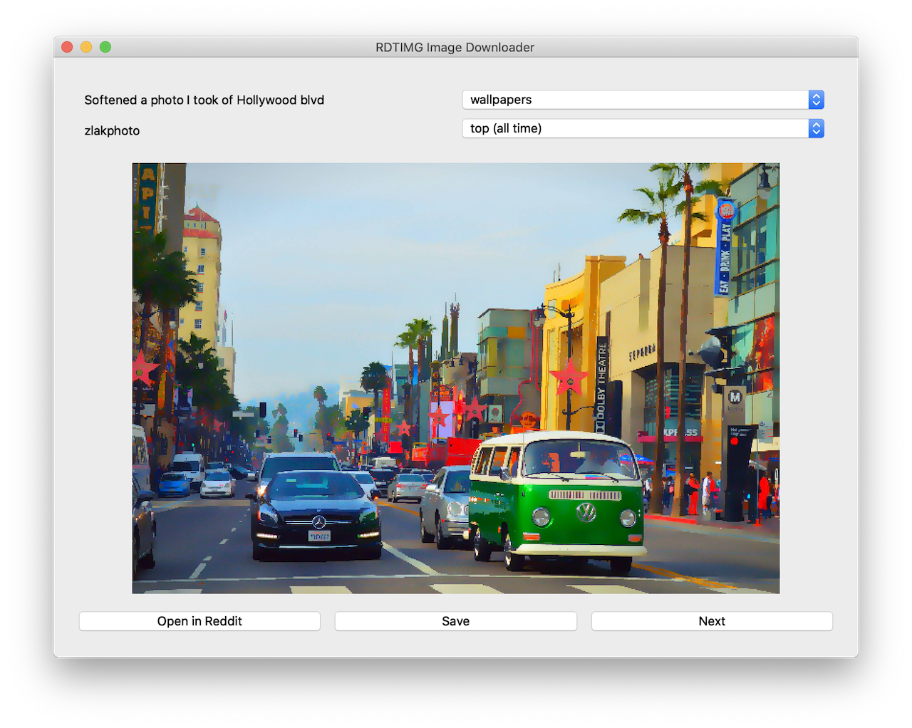

# RDTIMG Reddit Image Downloader
> A fast, cross-platform, and minimalistic image viewer and downloader!

Tested on: MacOS Catalina, Ubuntu


## How To Build?
> Instructions for MacOS Catalina, Ubuntu

Install Dependencies:
First, install Anaconda, Miniconda (preferred), or VirtualEnv:<br /> (replace conda with whatever virtual environment you are using)
```bash
conda create -n rdtimg python=3.7
conda activate rdtimg
python -m  pip install -r requirements.txt
```

Generate Config: <br />
First, go to: https://www.reddit.com/prefs/apps and generate developed application key. <br />
Next run,
```bash
python generate_config.py
```

(Optional: Add to Bash if `echo $LD_LIBRARY_PATH` returns a blank line)
```bash
export LD_LIBRARY_PATH=~/miniconda3/lib
```

Build Application:
```bash
pyinstaller --onefile --add-data="config/config.json:config" app.py && cp config/praw.ini dist/praw.ini
```

Finally Run:
```bash
cd dist && ./app
```

## What About Binaries?
To be honest, I am not 100% on the licensing behind some of the dependences, additionally, this program requires a unique key from Reddit, so at the time there will be no binaries :(

## What If I Want To Add New Subreddits?
You can add them to `config.json`

## Where Are The Images Saved?
They are saved to a cache folder in the same directory as the program